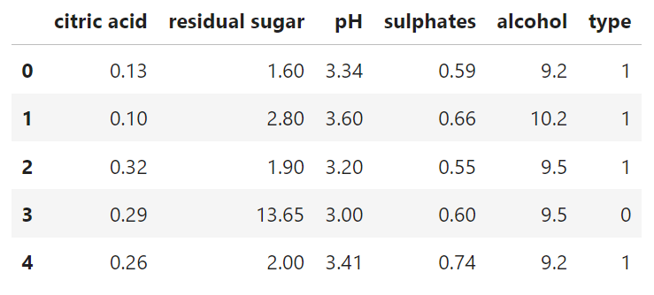
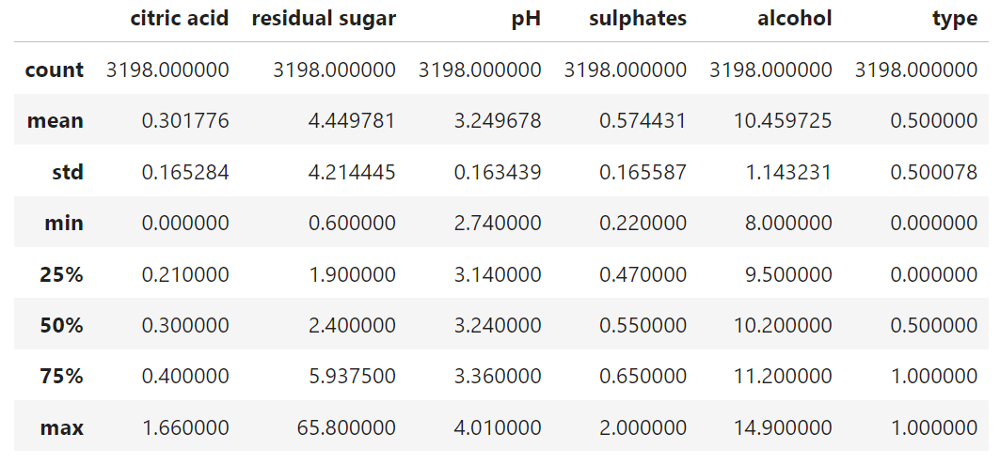

# Implementation and comparison of decision trees

## Description of data and approach

The dataset contains information on white and red wine.
It has 5 feature columns and 1 label column.
The feature columns are; citric acid, residual sugar, pH,
sulphates, and alcohol. All of the feature columns contain continous values.
The label column is the type of wine, 0 for white wine, and 1 for red wine.

There has not been any processing on the dataset and it is 
used as it is when training and testing the models.

     

## Code overview

The packages used in this project are as follows:

- numpy: matrix operations in implementation
- pandas: initial read of dataset
- sklearn: data splits, accuracy score, and cross validation
- copy(std library): deepcopy for pruning
- collections(std library): counting majority label

The implementation has been written in an object oriented fashion.
The code is divided into four parts, each with their own task:

- DecisionTree.py
- Node.py
- Evaluation.py
- main.py

DecisionTree.py is the class implementing the decision tree.
Node.py is a class representing a node in the decision tree.
Evaluation.py is a class for evaluating and finding the best model
for different implementations.
main.py brings the whole program together and
trains, evaluates and tests models, then outputs the results

Most methods in the code are well documented,
so I will only be explaning the methods that builds and prunes the tree,
and the methods for evaluating models in the Evaluation class.

### Building the tree

When calling the learn method, it recursively builds the root node with the _build_tree method
from input features and labels.

There are two stopping criteria when building the tree:

- there is only one unique label
- the rows of all features are equal

In these cases the method returns a leaf node with the majority label as value.

Then it calculates the best possible split with the method _best_split,
and splits the data on the best feature and its threshold.
It uses either the gini index or entropy when calculating the information gain
for finding the best split.
The method recursively calls itself on each branch and then returns a decision node

The whole tree is stored in the root_node variable.

\newpage

### Pruning the tree

When pruning the decision tree, it first creates a deepcopy of the decision tree.
The pruning itself is implemented using depth first search.

First we create an empty set of visited nodes.
Then we call the the recursive helper method _prune with the set of
visited nodes and the unpruned tree as input.

The steps of the recursive method are as follows:

1. If the current node is None, do nothing
2. If the current node is not visited, add it to the set 
3. If the current node is a leaf node, convert the previous 
node to a leaf node, and remove it's children. Else explore 
left and right branches.
4. If the accuracy of the pruned tree is worse, restore the nodes and contiune pruning.
Else continue pruning.

### Evaluating the best model

Model evaluation is handled in the Evaluation class. The class is initialized
with the training set and an optional random state.

The class has two methods. One for evaluating the best implemented model,
and one for evaluating the best DecisionTreeClassifier from sklearn.

Both evaluations use K-fold cross validation to find the best model parameters.
K-fold is splitting the traning set into 10 parts.
Since the dataset is balanced with equal amounts of each label, there is no need
to use Stratisfied Kfold.

\newpage

## Results

Training and test is split 80/20.

For calculating performance, I used the metric accuracy_score
from sklearn. It is used in both validation and testing.

The program was runned 5 times, test results can be found at the end
of this section. I choose to leave out the cross validation results 
for each possible model in the report. These results can be found by
running the program with the given seed of the run.

Results on each run seems pretty consistent.
Run 1 and 3 has a better accuracy score on validation than test.
This is the case for both my implementation and sklearn.
One could say the models are overfitting in these cases,
but I'm more inclined to say it is the randomness when
splitting the training set.
The other three runs have a better test score than validation.

Accuracy on the test set varies between 88-91% for both
my implementation and sklearn. For all runs, using entropy without
pruning yields the best model in both the implemented method and sklearn,
except for run 5, where sklearn uses gini instead.

Both implementations' accuracy on the test set are almost identical
with less than 1% difference in all runs.

The biggest difference between the implementations is the training and
testing time.
Sklearn's implementation is on average 100 times faster than my 
implementation.[^1]

There is most likely a lot of optimizations that have been implemented,
which I don't know about or know how to implement.
There is no inherent reason to choose my implementation over sklearn's.
The accuracy is practically the same, but speed difference is too great
to not use sklearn's implementation

[^1]: Time will vary depending on system hardware

\newpage

### Runs

#### Run 1 

Run using seed: 52

Best implemented model with parameters: ('entropy', False).

accuracy: 0.8859375

Time training and testing: 0.4429490566253662

Best sklearn model with parameters: entropy

accuracy: 0.8828125

Time training and testing: 0.004796028137207031

#### Run 2

Run using seed: 255

Best implemented model with parameters: ('entropy', False).

accuracy: 0.9125

Time training and testing: 0.4602997303009033

Best sklearn model with parameters: entropy

accuracy: 0.9078125

Time training and testing: 0.004965066909790039

#### Run 3

Run using seed: 808

Best implemented model with parameters: ('entropy', False).

accuracy: 0.878125

Time training and testing: 0.43852901458740234

Best sklearn model with parameters: entropy

accuracy: 0.8796875

Time training and testing: 0.004686594009399414

\newpage

#### Run 4

Run using seed: 100

Best implemented model with parameters: ('entropy', False).

accuracy: 0.8953125

Time training and testing: 0.44951915740966797

Best sklearn model with parameters: entropy

accuracy: 0.890625

Time training and testing: 0.005068778991699219

#### Run 5

Run using seed: 15

Best implemented model with parameters: ('entropy', False).

accuracy: 0.896875

Time training and testing: 0.4822375774383545

Best sklearn model with parameters: gini

accuracy: 0.896875

Time training and testing: 0.004837989807128906
